# Administration
## Tools
- Markdown, maybe obsidian
- KANBAN on GitHub with projects.
- AI tool for commit message generation and PR. I think that's important because its like getting feedback from another dev.

## General Procedure
- Create as simple as possible and deploy immediately. Aka work on all steps in parallel.
- MVP
  - is a homepage with a canvas, which can recognize a letter and store this letter with image and true label (if the user provides it)
  - This is great, because with that the project is using all parts (backend/db, ml, frontend, ci/cd)

## Timetable 
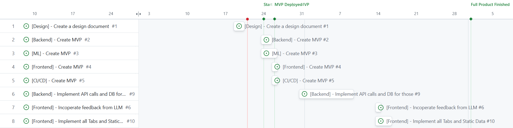

---
  
# Backend
## Overview
This project aims to show my skills as well as learning alot about full stack developement and best practices. The goal would be to have a web page I'm proud about and which is deployed via AWS.
### Scope
- Creation of a coherent fullstack application with personal touch. An important part is a ML model with correct MLOps and a nice CI/CD pipeline.
- Creation of API calls which tie together the frontend, DB and ML pipeline.
- Integration of LLMs and standard deep learning models as well as generative models.
- Maybe a content management system for blog entries etc and a login function for users (eg enable more generations or LLM queries)
### Non-Goals
- Doesn't need to be perfect, this will be a WIP for my whole career as I will always add features.
- Doesn't need to be a solution to a problem, it's a learning and prestige project.
  
## Requirements
### Functional Requirements
- API calls, such that the ML models, DB and UI work as expected.
- Efficient data and ML pipelines, to drive down cost on AWS.
### Non-Functional Requirements
- Maintainability
- Usability
- Efficiency (to drive down cost on AWS).
- Readability
- Documentation
## Architecture
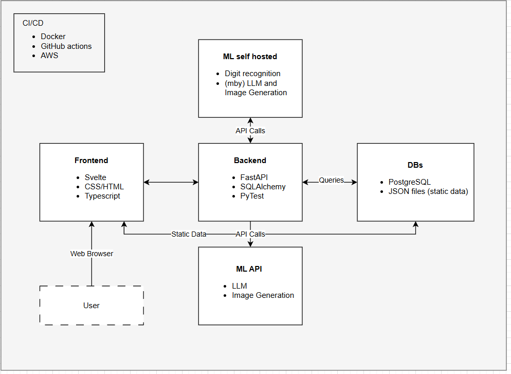
## Tech Stack
- FastAPI
- SQLAlchemy
- Pytest
- GitHub
- Venv
  
## API Endpoints   
Static routes should be frontend only.

### MVP APIs
1. /ml/recognition (Input: drawing/pixel values, Output: prediction 0-9)

### Full project APIs
1. /ml/recognition (Input: drawing/pixel values, Output: prediction 0-9)
2. /ml/recognition/feedback (Input: drawing/pixel values and label, Output: None, stores drawing and label in DB)
3. /ml/generation (Input: drawing and prompt, Output: generated image)
4. /ml/llm (Input: prompt, Output: answer and flag whether feedback)
5. /ml/llm/feedback (Input: feedback from user, Output: None, stores feedback in DB)
6. /ml/innovation (Input: drawing/pixel values, Output: prediction 0-9)
7. /ml/innovation/feedback (Input: drawing/pixel values and label, Output: None, stores drawing and label in DB) 

## Security
- SQL-Injection
- XSS
- CSRF
- Insecure Deserialization
### Solution
- SQL-Injection: Use ORM in SQLAlchemy, 
- XSS: Use nh3 or bleach for sanitization
- CSRF: Use libraries like fastapi-csrf-protect
- Use pydantic which automatically validates and sanitizes incoming data.
- Use HTTPS, rate limiting, security headers
- Keep dependencies updated and use as little libraries as possible.
  
## Testing
- Unit testing
- Integration Testing
- E2E on my own / no automation.
  
## Risk & Assumptions
### Risks
- Financial risk (eg wrong AWS settings, ML models exploit)
- Time sink (spending too much time on this project)
### Assumptions
- There is minimal benefit for attacking the system.
- There will be next to no visitors (maybe host it via raspberry pi)

## Conclusion
This document gives an short overview of the architecture, tech stack and API calls for the backend of this project. **FastAPI** will be used since I already have experiences with it and it's the right tool for this job - since there shoulnt be much else than API calls. 

I have to learn more about security and check if everything is fine on the go. But this should not be as bad since I assume there is little to gain from hacking this page.

---

# Machine Learning
## Ideas
-  create a canvas where an user can draw, and then 1. recognize which they wrote and 2. create a image from that (eg given a word, create s cool signature). See [svelte tutorial for canvas]( https://svelte.dev/tutorial/svelte/actions)
-  create a NN visualization, i think thats cool to see.
-  start with a picture of myself which gets recognized from a ml model (eg short video) and which says 90% human or so and say you can trust me im 90% human lol
- Roman mentioned that it would be nice to have something like a doodle, and then AI generates an image from that. Maybe add a prompt as well.
-  show all parts of ML aka 1. predition with nn and letter recognizing, then generation (doodle to art), then innovation eg draw a arrow left/right to come to other pages or 1, 2, 3 to come to home about etc.
-  a llm chatbot which answers questions about me and mainly to get feedback from the user.
- Or for generation create a **cute dog/cat** generater and learn what people like more and show this to them (given gender, age, ..)
### Optional
-  something like finding fastest path in random world (and compare that with A*), or user draws obstacles and RL-agent must find way out.
  - Or an algo which doesn't predict optimal but the steps of a human (given a fixed env) 
-  visualization of other algos.

## MLOps
- Research about how to store data etc:
    - For simple images like from MNIST it should be fine to store them as a string for each pixel. Else we should store the image data eg in s3 buckets and then just store the link in the database.
  
---

# Database
- PostgreSQL, because it's supported by SQLAlchemy, I have experience with it and its state of art / has proof of time.
- Full-text search and indexing might be great down the line as well.
- Not sure how to handle data from ML yet. **Ponder** can we store all data we need (image, text, ..) in postgres? => most likely best practice would be to storeimage data in a s3 bucket and only store the link to the data in the DB. **ACTUALLY** i could simply store the image as a string of 0s and 1s as it is in MNIST which is 28x28 pixels.
## Datbase Design
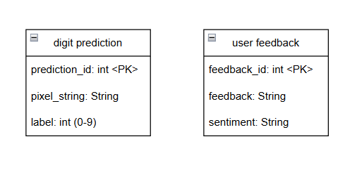
## Dataflow
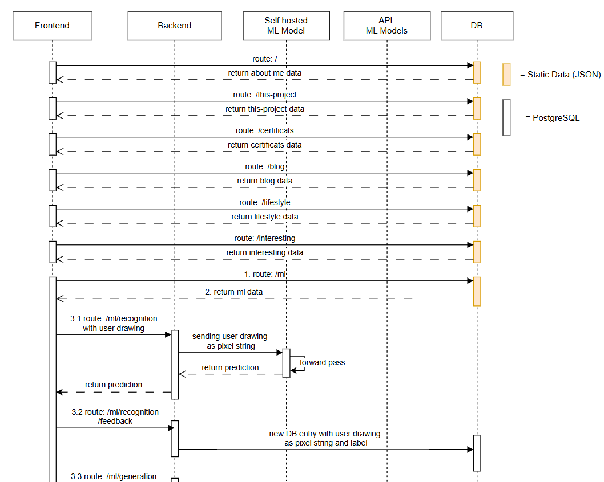
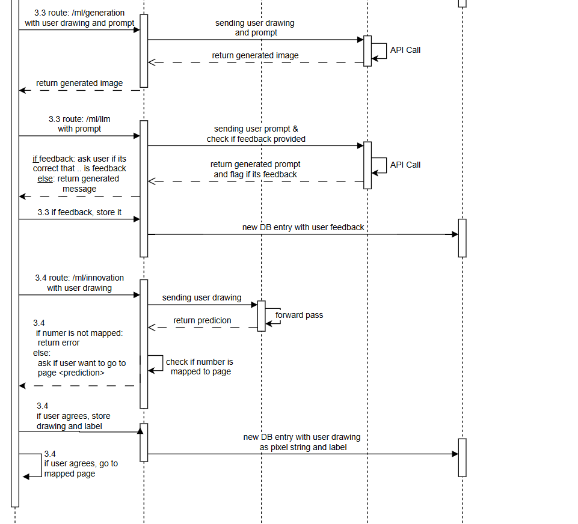

---

# Frontend
I do think the most important part here is that it looks nice, testing and security since it's such a small site and im the sole contributor. Therefore the design document will not be as deep as for the backend.
## Tech Stack
- Svelte
- CSS / HTML
- TypeScript

## Security
As in the backend **XSS** and **CSRF** need to be dealt with. Aditionally **SSR** (server side rendering)
can be an issue.

Therefore, I need to make sure that we sanitize the user Input and that we don't leak important data while doing server side rendering.
Additionally, make sure that packages are up to date.

## Testing
- Only E2E testing as human.
- Maybe in a future iteration I will add automatic tests.
  
## Design
- Elias uses Fimga, Emre mentioned moqups.com and DrawIO are nice. What i have seen Penpot could be great as well.
- Check out [chat]([https://www.notion.so/Active-Stuffses-473f9c31d1164d3c830e15c98ba69888?pvs=97#294ef8386774466ea2525b5383f4a5e2](https://you.com/search?q=Which+design+of+my+personal+webpage+do+you+htink+makes+sense%3F+Should+i+make+it+more+professional%2Fstrict+or+more+personal%2Fcool%3F+Eg+dark+theme+etc%3F&fromSearchBar=true&tbm=youchat&chatMode=custom&cid=c0_c4a7a39f-0a89-4b7a-a77c-be903b92105a)) and check other blogs/posts.
- Check out [svelt pages]( https://github.com/w3cj/svelte-5-tasks-app/tree/main) and other svelte based public projects for inspiration
- Check out [web of devs](https://webofdevs.com/ ) i like the design of https://raphaelameaume.com/ and https://antfu.me/ 
- Mby create a generative background, like in [chat](https://you.com/search?q=how+to+generate+background+as+in+https%3A%2F%2Fraphaelameaume.com%2Fde+and+https%3A%2F%2Fantfu.me%2F%0A%0Aso+eg+a+growing+tree%3F&fromSearchBar=true&tbm=youchat&chatMode=custom&cid=c0_009e6455-60e2-4e80-ae45-4066d81613c7) but obviously much more sufficicated.
- [dotbite](https://dotbite.at/de/webentwicklung?gad_source=1&gclid=Cj0KCQjw7dm-BhCoARIsALFk4v8FYDrB6D8BZ9lssPjSIksTTQ_vi5A3ktEbGsFJ_yLYo6QBjeGpmgMaAmViEALw_wcB) has a nice design as well.
- [Paletton](https://paletton.com/) for color design.
  
### MVP Design

---

### Full Design
I have got nice feedback from [LLM](https://you.com/search?q=Which+design+of+my+personal+webpage+do+you+htink+makes+sense%3F+Should+i+make+it+more+professional%2Fstrict+or+more+personal%2Fcool%3F+Eg+dark+theme+etc%3F&fromSearchBar=true&tbm=youchat&chatMode=custom&cid=c0_c4a7a39f-0a89-4b7a-a77c-be903b92105a) and good points which I should fix. Most of those were because i created a quick verison and not the final one.

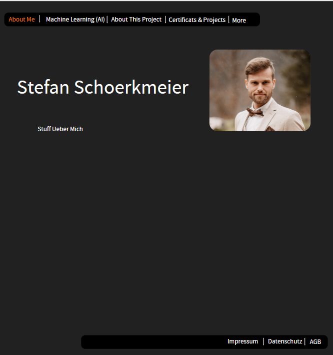
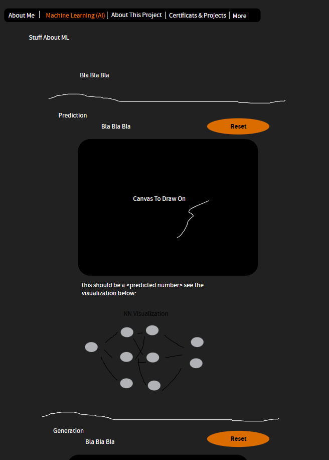
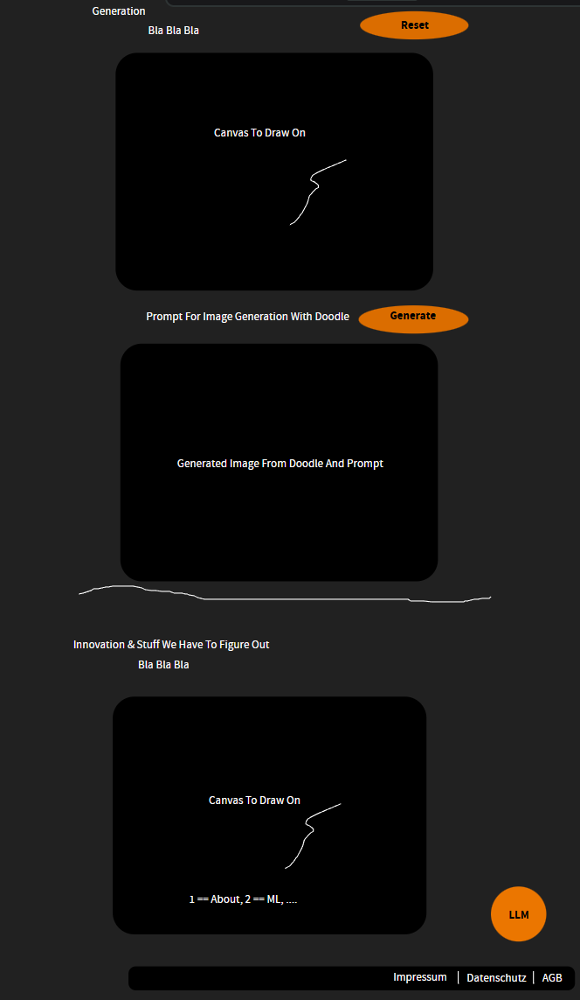
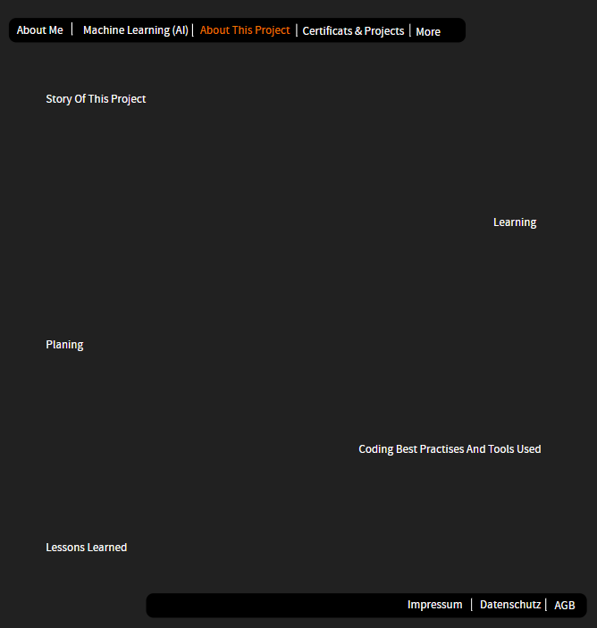
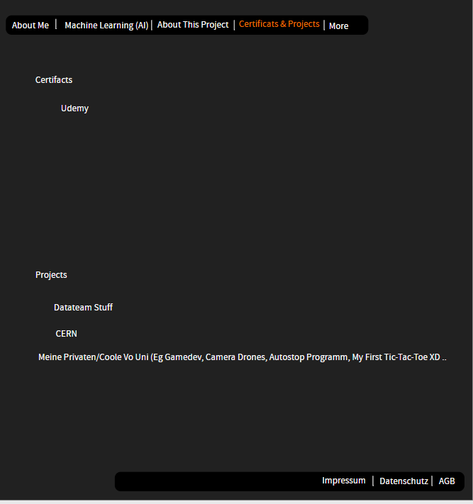
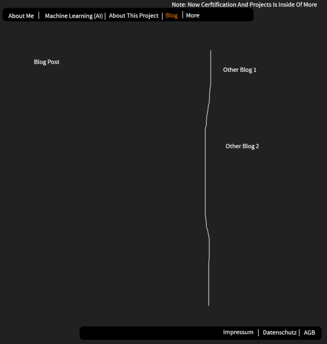
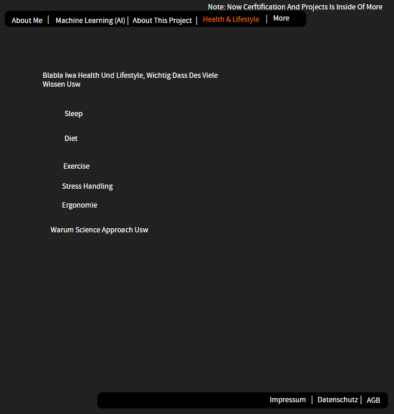
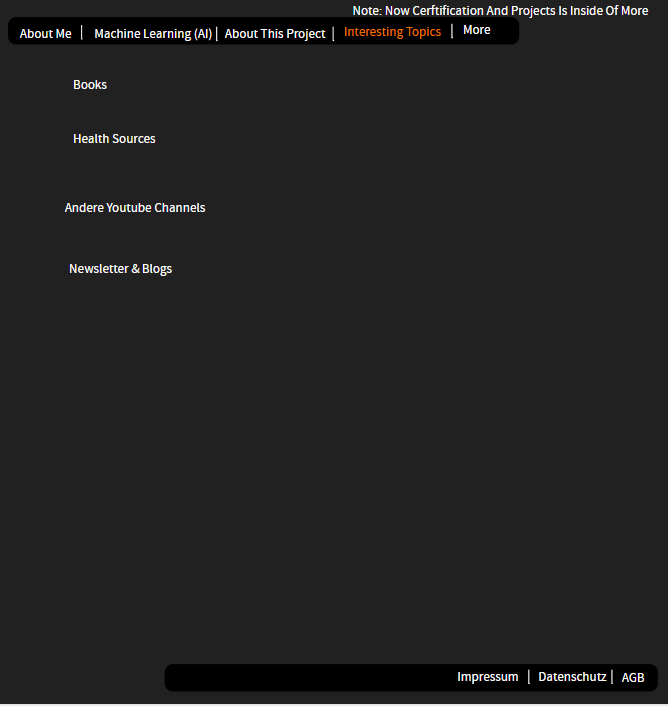

## Tabs
- Home
- About Me
- Machine Learning / AI
- This project (what i have learned, what my process was (learning in advance/best practices etc), storytelling here)
- More
  - Certificats / archivements
    - (mby) projects from udemy/lvs (game dev, ros/camera drones, ...),
    - (mby) also thing from leetcode etc, or build my own linked list / tree which is easy but maybe still cool for people to see.
    - Other proejcts which i will build in future like a smart mirror or so
    - Or small usefull projects like my autoclose projects thing xD or my first program (tic-tac-toe for meme xD)
  - Blog
  - Health stuff (area im as passionate about as computer science, things seem complex but actually quite straight forward eg food)
  - Great Sources (youtubers i like, stuff about health, cool books (eg Lean Startup, ..), ...)

---

# CI/CD
- Docker because state of the art.
- AWS because it has proof of consensus and should be great for future jobs since it's in demand.
- GitHub actions because most modern approach and makes sense over GitLab since GitHub is used more often for public repos.
- PR advanced flow as suggested from Bret Fisher (see my [docker repo](https://github.com/Steveineiter/docker-udemy/blob/main/CICD.png) for more).
